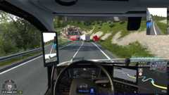

# Help improve AEB and ACC

Shares short recordings of your driving so the braking and cruise control can be tested against real situations. Off unless you tick it. Unticking stops it.

## Why

AEB and ACC are tuned by replaying recorded driving situations, each one hand-labelled as a good brake, a phantom brake, or a missed one. Today every single recording comes from one person on one machine, so anything that only happens to you never gets tested.

More clips means fewer phantom brakes and better lead-vehicle tracking.

## What is shared

Nothing is recorded during ordinary driving. A clip is made only when the AEB warns or brakes, or on a collision, covering the 11 seconds around it:

- Your speed, steering, in-game position, trailer, cargo mass, and how hard your truck can brake
- The vehicles around you, as raw game numbers. No player names, ever
- What the AEB decided, and why
- MonoCruise version, your AEB settings, the time, and singleplayer or TMP

Never your files, your Windows or Steam name, your other settings, or anything at all from outside the game.

## One screenshot

**On by default. Uncheck it and the rest still works.**

Without a picture I cannot tell a slip road from a lane, or whether the truck ahead was turning off or stopping, and a mislabelled clip is worse than none. So each clip carries one small image of the game at that moment, exactly this size:

Layout and vehicles are clear, text is not. Your speed, city names, job details and chat are all unreadable at this size. Only the game window is ever captured, never anything else on your screen.

## The honest part

There is no account and no ID. Nothing marks which clips are yours, which also means they cannot be found and deleted later, and they are kept indefinitely: an old clip is still a valid test. Your IP is visible to the server like on any website, and is not stored with the clips.

Clips are used to tune AEB and ACC. Never sold, never shared, no ads, no analytics. Just AEB/ACC improvements.

MonoCruise tells you when clips are sent, and the button next to this setting lists everything that has been. Untick the box any time to stop.
